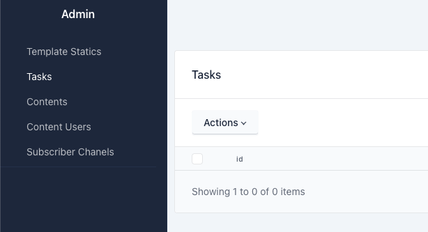

#### Changelog:
v0.0.10 - notify mvp version
v0.0.20 - templater service complete
v0.0.20 - newsletter service add

Этот репозиторий: [https://github.com/26remph/notifications_sprint_1.git](https://github.com/26remph/notifications_sprint_1.git)


# Notification сервис для on-line кинотеатра

## О сервисе

Сервис реализующий возможность работы с маркетинговыми рассылками и уведомлениями пользователей.  

## 1. Описание разрабатываемой функциональности
Севрис состоит из слкедуэщих компонент.

#### Templater
- Реализует CRUD API для работы с шаблонами рассылок. 
- Шалоны сохраняются в базе данных MongoDB. Тип шаблонов jinga2 
- Парсит макеты и проводит валидацию переменных;

#### Notify
Микросервис отвечающий за реализацию доставки уведомлений пользователей.
В основе своей имеет Celery + RabbitMQ + Cellery worker + Cellery bit. В качесвте результирующего бэкэнад Redis.
Сообщения сначала попадают в воркер отвечающий за обогащение макетов, потом в воркер по отправке макетов. Для периодической рассылки имеет свой воркер. Так же имеется воркер для системных событий. Что обеспечивет распределение нагрузки.

- Принимает и отправляет мгновенные сообщения от ссервисов auth, ugc;
- Отправляет немедленную рассылку ручную от сервиса newsletter;
- Принимает и выполняет переодические задач от сервиса маркетинговой рассылки newsletter
- Выполняет системные задачи синхронизации

### NewsLetter
Занимается отправкой созданных рассылок от менеджеров кинотеатра. Имеет сво базу данных
[Схема базы данных](https://dbdesigner.page.link/Fnz83LWdQYdgChVo6)

Стек: PostgresSQL + alchemy + alembic + sqlaadmin

- Сервис создает рассылку, указывает получателей и шаблон после чего отправляет его в сервис `notify`;
- имеет свою админ панель



## 2. Архитектура решения

### Схемы архитектуры

Архитектурно выбрано REST API c реализацией на fastapi и в качестве хранилища MongoDB, Postgres, Redis


### Технологии

Для реализации выбран следующий стек технологий  


  


  
  

## 3. Как запустить проект

<details>
<summary>Полный запуск на локальном хосте</summary>
<p>

1. Для работы проекта необходимо установить `docker`. Проверить доступность команды `docker compose` в вашей ОС.

    ```shell
        docker compose -f ./docker-compose.yml up -d
    ```

2. Запустить сервсисы в режиме разработки:

    ```shell
        make run-notify
        make run-news
        make rin-templater
    ```
Дождаться запуска. Процедура должна завершится бкз ошибок.


6. Если все прошло успешно, то будут доступны адреса (при настройке как в `.env.example`):

    * [notify API](http://localhost:8080/)  
    * [templater API](http://localhost:8088/)  
    * [newsletter API](http://localhost:8090/)  
    * [admin panel](http://localhost:8090/admin)  


7. Остановить сервисы командой:

    ```shell
        docker compose -f ./infra/docker-compose.yml down
    ```

</p>
</details>

## 4. Реализация

Представлена в репозитарии.  

## Об авторах

* [Вадим Барсуков](https://git.yandex-academy.ru/v.bars), python-developer

