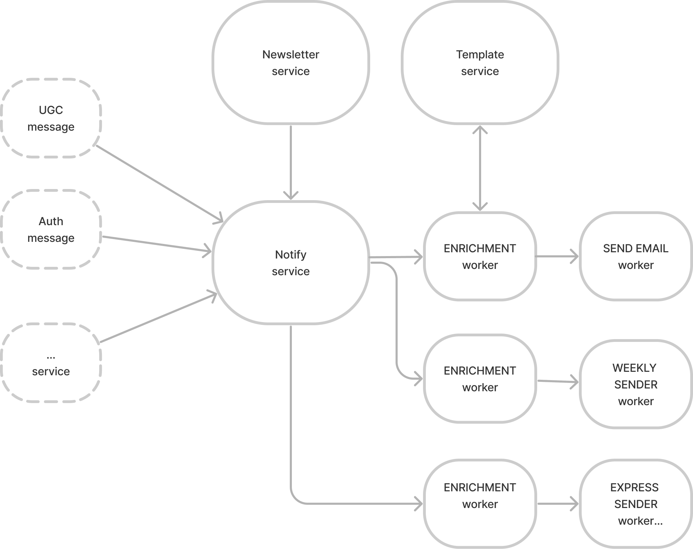

#### Changelog:
v0.0.20 - billing service MVP version  
v0.0.30 - billing api update: add endpoint

Этот репозиторий: [https://github.com/26remph/billing.git](https://github.com/26remph/billing.git)


# Billing сервис для on-line кинотеатра

## О сервисе

Сервис реализующий возможность работы с маркетинговыми рассылками и уведомлениями пользователей.

Сервис реализует возможность оплаты товаров и услуг через внешние платежные сервисы. В сервис заложена возможность регулярной сверки проводимых операций. Учет и состояние расчетов по каждой транзакций. Структура хранения платежной информации позволяет делать расширенный аналитический учет.

## 1. Описание разрабатываемой функциональности
Севрис состоит из следующих компонент:

#### Billing API
- Реализует возможность работы с внешними платежными системами, учитывая особенности интеграции каждой. 
- Реализует возможность сверки расчетов с внешним платежным провайдером. 
- Предоставляет возможность расширенной аналитики по пользовательским транзакциям.

По факту совершенной оплаты или отмены оплаты купленной услуги или товара реализует возможность постановки в очередь сигналов для внутренних сервисов кинотеатра, таких как auth service и notification service. В auth отправляются сигналы на предоставление доступа к контенту или его прекращении. В notification service отправляет сигнал об оповещении по email об успешной оплате. 

Стек: FastAPI + alchemy + alembic + RabbitMQ  
Хранилище: PostgresSQL
[Схема базы данных](https://dbdesigner.page.link/CzaATSRrwBsGm5Br5)

#### Provider manager
Python классы реализующие проксирование запросов от внутреннего Billing API к внешнему API провайдера. Основан на абстрактом классе, который должен уметь обрабатывать следующие сценарии:
- Обработка сценария одно стадийного платежа и двух стадийного платежа. Подробнее тут: [Одностадийный и двухстадийный платеж](https://pay.yandex.ru/ru/docs/custom/payment-stages)
- Обработка возврата от покупателя, в том числе частичного.
- Отмена/подтверждение платежа при вулюченной настройке двух стадийной обработке платежа.

Оперирует такими сущностями как:
`Order` - заказ покупателя
`Cart` - корзина заказа покупателя 
`Item` - продукты или услуги купленные покупателем
`Operation` - платежная транзакция  


Как точку роста класса мжно обозначить:
- работа с сущностью `Recipient` - чек покупателю.

Стек: Python + aiohttp + Pydantic
Хранилище: PostgresSQL

### Admin panel
- Обеспечивает возможность ручного редактирования и просмотра платежной информации администраторам Billing сервиса.
- имеет свою админ панель


### Scheduler
В MVP версии планировалась реализовать две переодиеских задачи:
- `CLEARING` - сверка взаиморасчетов по проведенным операциям в конце дня и закрытие зависших транзакций. Обнаружение оплат которые не были получены в `callback url` **Billing API** сервиса.
- `RENEWAL-SUBSCRIPTION` - Реализация переодического списания денег по заканчивающимся подпискам с отправкой. уведомлений

Стек: Celery + RabbitMQ + Cellery bit  
Хранилище: Redis (в качестве результирующего бэкэнад Redis)

## 2. Архитектура решения

### Схемы архитектуры

Графическое представление архитектуры и взаимосвязи между компонентами представлены на иллюстрации ниже.



### Технологии

**Общий стек технологий**


  

  


## 3. Как запустить проект

<details>
<summary>Полный запуск на локальном хосте</summary>
<p>

1. Для работы проекта необходимо установить `docker`. Проверить доступность команды `docker compose` в вашей ОС.

    ```shell
        docker compose -f ./docker-compose.yml up -d
    ```

2. Запустить Billing API сервис в режиме разработки:

    ```shell
        make run
    ```
Дождаться запуска. Процедура должна завершится бкз ошибок.


6. Если все прошло успешно, то будут доступны адреса (при настройке как в `.env.example`):

    * [billing API](http://localhost:8080/)  
    * [admin panel](http://localhost:8090/admin)  


7. Остановить сервисы командой:

    ```shell
        docker compose -f ./infra/docker-compose.yml down
    ```

</p>
</details>

## 4. Реализация

Представлена в репозитории.  

## Об авторах

* [Вадим Барсуков](https://git.yandex-academy.ru/v.bars), python-developer

